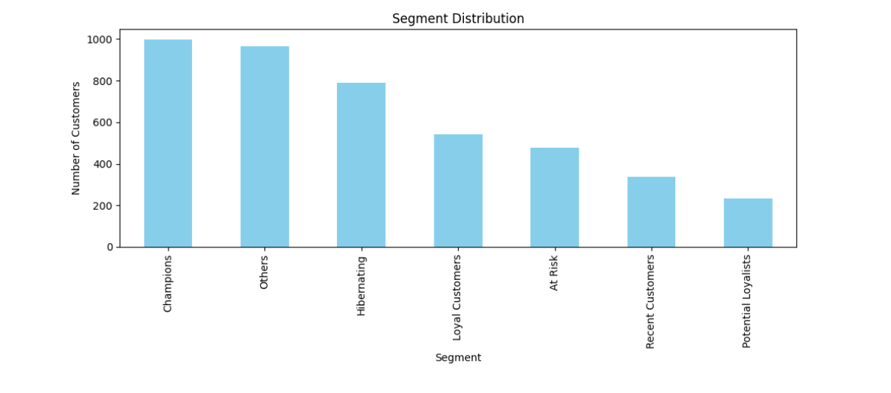
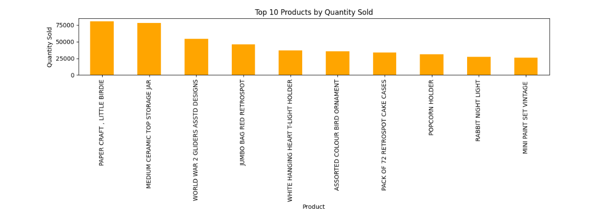

# Online Retail Dataset — Customer Segmentation & RFM Analysis

This project analyzes customer purchasing behavior using the Online Retail dataset.  
It combines **Python**, **SQL (DuckDB)**, and **RFM segmentation** to uncover actionable insights for e‑commerce businesses.

The goal is to identify high‑value customers, understand purchasing patterns, and support data‑driven marketing strategies.

---

## 📊 Project Overview

This analysis includes:

- Data cleaning & preprocessing (Python)
- Exploratory SQL analysis (DuckDB)
- RFM scoring (Recency, Frequency, Monetary)
- Customer segmentation
- Business insights & recommendations
- Visualizations for key metrics

The project demonstrates both **technical** and **business analytics** skills.

---

## 🧹 Data Cleaning

Performed using **Pandas**:

- Removed rows with missing `CustomerID`
- Converted `InvoiceDate` to datetime
- Created `TotalPrice = Quantity × UnitPrice`
- Identified negative quantities (returns)
- Ensured consistent data types for SQL queries

---

## 🗄️ SQL Analysis (DuckDB)

Key queries include:

- Top revenue‑generating products  
- Countries with the highest number of orders  
- Monthly revenue trends  
- Top spending customers  
- Most frequently purchased product  

SQL was executed directly on the cleaned DataFrame using DuckDB.

---

## 🧮 RFM Analysis

For each customer:

- **Recency:** Days since last purchase  
- **Frequency:** Number of unique invoices  
- **Monetary:** Total spending  

Customers were assigned a 3‑digit RFM score (e.g., 444, 321, 112) using quantile‑based ranking.

---

## 🧩 Customer Segmentation

Based on RFM scores, customers were grouped into:

- **Champions** — highest value, frequent buyers  
- **Loyal Customers** — consistent, engaged buyers  
- **Potential Loyalists** — new but promising customers  
- **At Risk** — previously valuable but inactive  
- **Hibernating** — long inactive, low value  

These segments support targeted marketing and retention strategies.

---

## 📈 Visualizations

### 1. Segment Distribution

### 2. Monthly Revenue Trend

### 3. Top 10 Products by Quantity Sold

---

## 🧠 Key Insights

- A small group of high‑value customers drives a large share of revenue  
- A notable portion of customers is at risk of churn  
- Revenue peaks strongly in Q4 (holiday season)  
- Sales are concentrated in a limited number of top products  

---

## 🛠️ Technologies Used

- Python (Pandas, Matplotlib)
- DuckDB (SQL)
- Jupyter Notebook
- RFM segmentation methodology

---

## 📎 Notebook & Report

**Kaggle Notebook:**  
https://www.kaggle.com/code/gulayaksoy/online-retail-rfm-analysis

**PDF Report:**  
[Online Retail Dataset.pdf](https://github.com/user-attachments/files/26647724/Online.Retail.Dataset.1.pdf)

---

## 📁 Repository Structure
online-retail-rfm-analysis/
│
├── notebook.ipynb        # Full analysis notebook
├── README.md             # Project documentation
└── /images               # (Optional) Visualizations for GitHub

---

## 📬 Contact

Created by **Gülay Aksoy**  
For questions or collaboration, feel free to reach out via GitHub.

